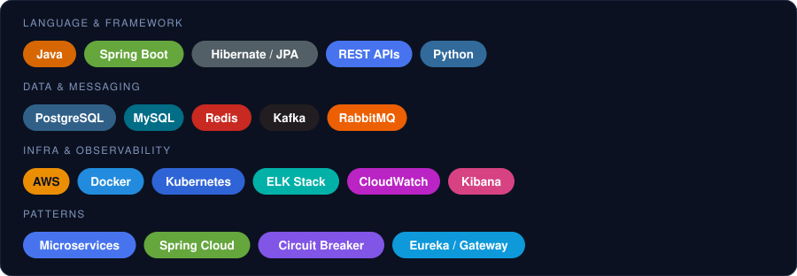
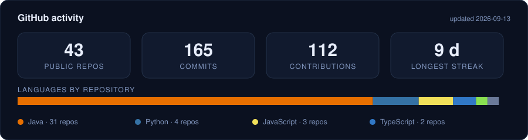
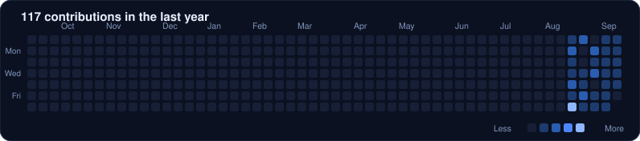

---

### What I work on

Backend systems in **Java and Spring Boot** — REST APIs, microservices, message-driven
pipelines and the reporting layers on top of them. Most of my day is spent on services that
process financial data, so I care about the unglamorous parts: correct retries, honest logs,
and being able to explain *why* something failed at 2am.

Lately I've been building **local-first AI** — assistants and debugging tools that run on
your own hardware instead of somebody's API.

---

### Tech stack

**Language & framework** — Java · Spring Boot · Hibernate/JPA · REST APIs · Python
**Data & messaging** — PostgreSQL · MySQL · Redis · Kafka · RabbitMQ
**Infra & observability** — AWS · Docker · Kubernetes · ELK Stack · CloudWatch · Kibana
**Patterns** — Microservices · Spring Cloud · Circuit Breaker · Eureka / API Gateway

---

### Featured projects

**[CHINTU — local AI assistant](https://github.com/pankajsharma21/local-ai-assistant)**
A fully offline Java assistant: chat, document Q&A over your own PDFs, a code assistant, and
voice — all on one local LLM. No cloud API keys, nothing leaves localhost. Spring Boot +
LangChain4j + Ollama, with the embedding model running in-process in the JVM.

**[AI_Debugger — from a log line to a fix](https://github.com/pankajsharma21/AI_Debugger)**
Give an AI coding agent a reference ID and a timestamp; it finds the right log source across
Kibana and CloudWatch, traces the failure into your code, proposes a fix with its blast
radius, and pulls JVM thread/heap dumps when the logs aren't enough. Includes an offline
`.hprof` parser, because the JDK has no way to read a heap dump file.

---

### Activity

These are generated from the GitHub API by
<a href="scripts/generate_stats.py"><code>scripts/generate_stats.py</code></a> and committed to this
repo by a daily Action — no third-party stats service is involved, so nothing here can break,
rate-limit, or watch who visits this page. The banner and terminal are hand-built SVGs; their
source lives in <a href="scripts/"><code>scripts/</code></a>.
